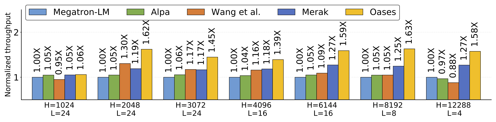
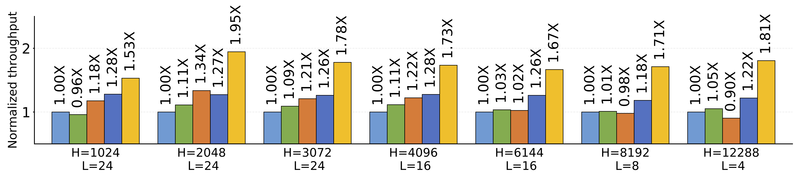

# Automated Tensor Model Parallelism with Overlapped Communication for Efficient Foundation Model Training

This repository is the official implementation of paper **Automated Tensor Model Parallelism with Overlapped Communication for Efficient Foundation Model Training**. 
In this paper, we present **Oases**, an operation overlapping and automated model partitioning approach to accelerate tensor model parallelism (TMP) training of foundation models. 

Oases features two novel modules:
-  **A fine-grained overlapping TMP training schedule**, which overlaps communication with computation whenever feasible, thereby accelerating TMP training.
-  An automatic model parallel strategy planner named **Oases planner**, to attain further accelerations. We propose a new cost model which can estimate the performance of models considering the training schedules with overlapped communications. 

We evaluate the performance of Oases with seven models of varying sizes on two GPU clusters, each equipped with 32 GPUs. 
Compared to four popular model-parallel training methods including the state-of-the-art libraries, Oases accelerates the overall training process with up to **1.48X** speedup over the best baseline, and up to **1.95X** speedup over Megatron-LM.

Normalized performance on NVLink 3090 cluster:



Normalized performance on 3090 cluster:




## Install Oases

To install package:
```setup
pip install torch==1.10.0+cu113 torchvision==0.11.0+cu113 torchaudio==0.10.0 -f https://download.pytorch.org/whl/torch_stable.html
pip install .
```
Please use it in a distributed environment. 

## Sample usage
Creating language models with Oases and training with operation overlapped TMP.
```python
import oases
import torch
# Create an Oases model
model = oases.BenchmarkLM(schedule='oases', # using Oases training schedule
                        num_l=24, # number of transformer layer
                        h=3072, # transformer hidden size
                        n=48, # number of attention heads
                        tp=4, dp=1 # TMP and DP degrees
                        )

# Training with Oases                        
for (inputs, label) in data_loader:
    x = model(inputs)
    loss = torch.nn.functional.cross_entropy(x, label)
    loss.backward()
```

## Benchmark scripts

We provide scripts in benchmark folder for performance benchmarking.
Our scripts are based on [Slurm](https://slurm.schedmd.com/documentation.html) and servers with 4 GPUs each.

### Benchmark overlapped training schedule

We provide a `torch.distributed.launch` script in `benchmark/overlap_run.sh`. 
Sample useage of the script with [srun](https://slurm.schedmd.com/srun.html):

```
srun -N 1 -n 1 bash overlap_run.sh
```
Available training schedules are: 
```
default_checkpoint: default recomputation implement
optim_comm_checkpoint: schedule with fine-grained recomputation strategy
overlap_checkpoint: schedule with cross-pass overlapping schedule
oases: Oases fine-grained overlapping TMP training schedule
```
Please check the script for further instructions.

### Benchmark Oases planner

Please generate a profiling data before use Oases planner. We provide a [sbatch](https://slurm.schedmd.com/sbatch.html) script.
A sample usage is:

```
cd benchmark/profile
sbatch sbatch_profile.sh
```
A profiling database will generated after running the sbatch script, to use Oases planner, please add `--auto_plan --profile_path './path/to/profile_res.pt'` to the `overlap_run.sh` script.

Please check the scripts for further instructions.


## License

Oases is licensed under the [Apache-2.0 license](./LICENSE).
